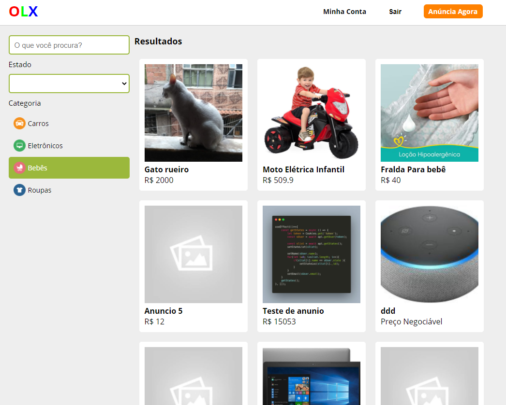

# OLX


# Sobre o projeto
OLX é uma aplicação front end e pegando informações de um api no back end construída durante na aula na plataforma B7Web.

A aplicação consiste sistema de classificados, onde os usuários possa cadastrar anúncios, possa filtrar para pesquisa e também pegar contato para dos vendedores negociar.


# Layout Web 



# Tecnologias utilizados
## Front end
- HTML / CSS / JS
- ReactJS
## Back end
- Cosumindo Webservice (NodeJS)

# Como executar o projeto
Pré-requisitos: npm / yarn

```bash
# clonar repositório
git clone https://github.com/marlinho20/Olx-Clone

# instalar dependências
yarn install / npm install

# executar o projeto
yarn start / npm start
```